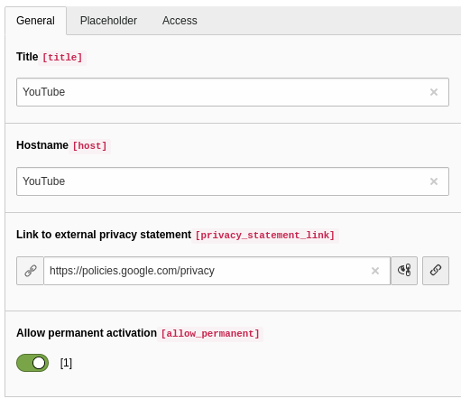

.. include:: ../Includes.txt

.. _administrator:

==============
Administration
==============

.. _installation:

Installation
============

Basic Setup
-----------

#.  Install media2click via the extension manager.
#.  Include the extension's static template into your TS template.
#.  If your main PAGE object is not named 'page', adapt the TypoScript Setup accordingly.
#.  Activate the extension's functionality via the Constant Editor: :ref:`constants-enable`

If individual placeholder content or permanent activation is required:
----------------------------------------------------------------------

5.  Globally allow permanent activation via the Constant Editor: :ref:`constants-enablepermanently`
#.  Set up a page of type sysfolder to hold the host data.
#.  Set storagePid to this sysfolder's uid via the Constant Edtior: :ref:`constants-storagepid`
#.  Using the list module, add a host configuration to your storage page for every target host that needs individual
    placeholder content or permanent activation: :ref:`hostconfiguration`
#.  Insert content elements of type "Insert Plugin" -> "Toggle permanent activation of external content" on your privacy
    statement page. You can filter the list of shown host in the plugin options.
#.  Set privacyPid to the uid of your privacy statement page via the Constant Edtior: :ref:`constants-privacypid`

.. _hostconfiguration:

Individual Host Configuration
=============================

   Example host configuration for YouTube videos

For videos, you have to use "YouTube" and "Vimeo" as the hostname.

.. _hosttemplate:

Individual Host Templates
=========================

If individual text and logo is not enough, you can configure individual fluid templates for your hosts' placeholders:
Just add a file named after the host in Fluid Styled Contents' partial root paths. For example for the host www.example.com
this file would be named (...)/Partials/Media2click/Placeholder/www.example.com.html

There is an example template for www.example.com included in this extension.
