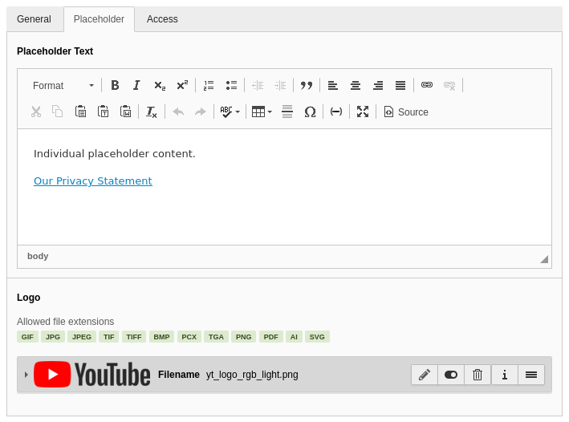

.. include:: ../Includes.txt

.. _administrator:

==============
Administration
==============

Basic Setup
===========

- Include the extension’s static template into your TypoScript template.
- If your main :ref:`PAGE <t3tsref:page>` object is not named ‘page’, adapt the TypoScript Setup accordingly.
- Activate the extension's functionality via the Constant Editor: :ref:`constants-enable`

Advanced Setup
==============

If individual placeholder content or permanent activation is required
---------------------------------------------------------------------

- Globally allow permanent activation via the Constant Editor: :ref:`constants-enablepermanently`
- Set up a page of type sysfolder to hold the host data.
- Set storagePid to this sysfolder's uid via the Constant Edtior: :ref:`constants-storagepid`
- Using the list module, add a host configuration to your storage page for every target host that needs individual
  placeholder content or permanent activation. For videos, you have to use "YouTube" and "Vimeo" as hostnames:

.. figure:: ../Images/HostConfiguration.png
   :alt: Host Configuration Form: General
   :class: with-shadow

   Example host configuration for YouTube videos

- You can add individual placeholder content and/or a logo in the placeholder tab:

   Example host configuration for YouTube videos

- Set privacyPid to the uid of your privacy statement page via the Constant Edtior: :ref:`constants-privacypid`
- Insert content elements of type "Insert Plugin" -> "Toggle permanent activation of external content" on your privacy
  statement page. You can filter the list of shown hosts in the plugin options:

.. figure:: ../Images/PluginHostList.png
   :alt: Plugin form
   :class: with-shadow

   Plugin BE form

.. _hosttemplate:

Individual Host Templates
-------------------------

If individual text and logo is not enough, you can configure individual fluid templates for your hosts' placeholders:
Just add a file named after the host in Fluid Styled Contents' partial root paths. For example for the host www.example.com
this file would be named (...)/Partials/Media2click/Placeholder/www.example.com.html

There is an example template for www.example.com included in this extension.
