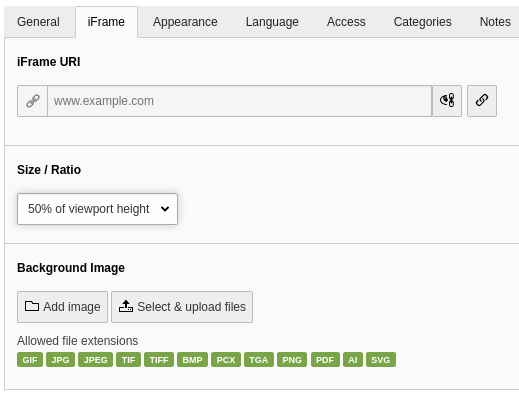
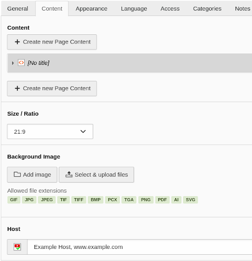

.. include:: ../Includes.txt

.. _user:

==============
User's Manual
==============

Video
=====
If set up correctly, no special attention is required from editors.
You can set the video to autoplay, so the visitor only needs to click once to start the video.

iFrame
======
Use the content element of type "iFrame with consent":

   CE "iFrame with consent" Form

You can choose an aspect ratio or height for the iframe and add a background image for the placeholder.

Any Content
===========
Use the content element of type "Content with consent":

   CE "Content with consent" Form

Add any content element to be displayed after activation only. This is primarily meant to be used with
the HTML content element, if the external content needs more than just an iframe or script to be included.

The activated content is rendered inside an iframe. All script and styling context of your site will not
be accessible, so the content has to be completely self-sufficent.

You can choose an aspect ratio or height for the iframe and add a background image for the placeholder.

The related host has to be selected from the list of configured hosts, as it can not be detected from the
content.
