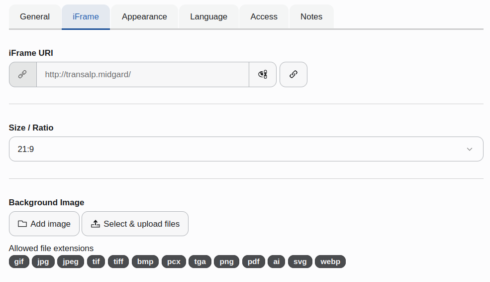
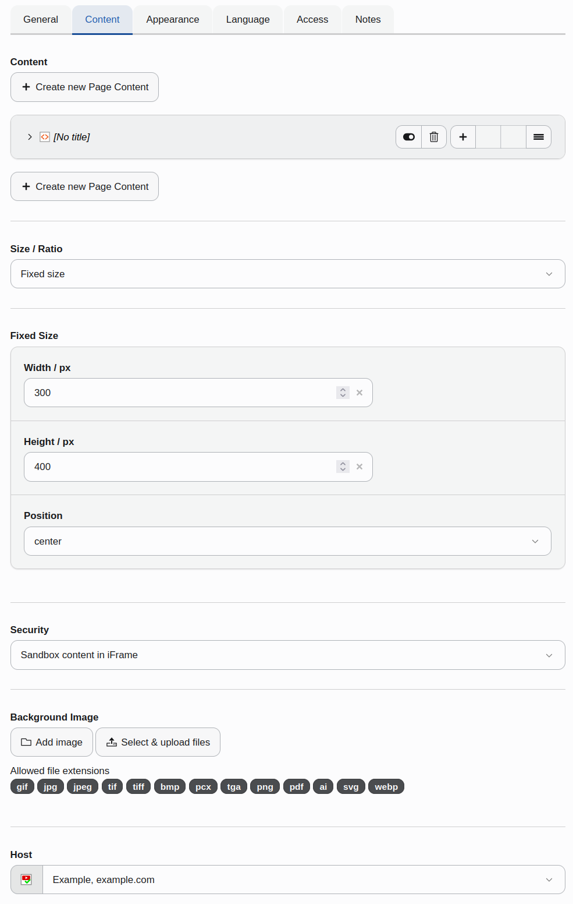

.. include:: ../Includes.txt

.. _user:

==============
User's Manual
==============

Video
=====
If set up correctly, no special attention is required from editors.
You can set the video to autoplay, so the visitor only needs to click once to start the video.

iFrame
======
Use the content element of type "iFrame with consent":

   CE "iFrame with consent" Form

You can choose an aspect ratio, height or fixed size for the iframe and add a background image for the placeholder.

Any Content
===========
Use the content element of type "Content with consent":

   CE "Content with consent" Form

Add any content element to be displayed after activation only. This is primarily meant to be used with
the HTML content element, if the external content needs more than just an iframe or script to be included.

You can choose an aspect ratio, height or fixed size for the content and add a background image for the placeholder.

The activated content can be rendered securly inside an sandboxed iframe or, more insecure, directly in your page.
With the iframe, all script and styling context of your site will not be accessible, so the content has to be completely self-sufficent.
Rendered directly, the content is more context-aware and does not need to adhere to the placeholders size settings.

The related host has to be selected from the list of configured hosts, as it can not be detected from the
content.

If the content is empty, the placeholder is not rendered at all. See :ref:`emptycontent` for the necessary prerequisites.
